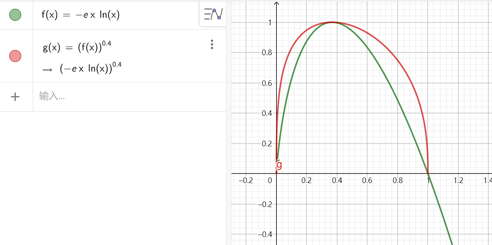
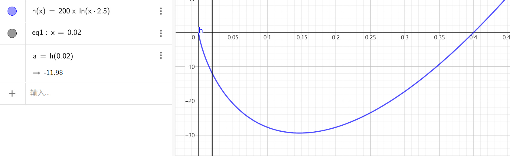
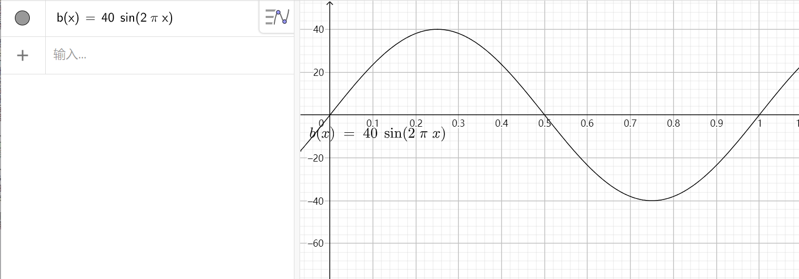

# 强风大窗口，但是Win32
对[BV1Kz4y1p7sz](https://www.bilibili.com/video/BV1Kz4y1p7sz)的拙劣模仿，8月份有的想法，拖到9月中旬才开始做，这歌的热度都过了。。。

纯ylg作品，我不怎么听日语V家的...

小时候看这集转行去做.Net了

# About
原作：[強風オールバック——ゆこぴ/小津/歌愛ユキ](https://www.youtube.com/watch?v=D6DVTLvOupE)

缓动算法/部分图片：[钅离_LX](https://space.bilibili.com/312642275)

第三方库：[Bass](https://www.un4seen.com/)

C#版项目地址：[PowerfulWindSlickedBackHair_Winform](https://github.com/CS-LX/PowerfulWindSlickedBackHair_Winform) （别人改过的：
[PowerfulWindSlickedBackHairCS-LX_Improve](https://github.com/SunnyDesignor/PowerfulWindSlickedBackHairCS-LX_Improve)）

程序设计：我

# 瞎放几张图吧
缓动算法，反正我想不出来，直接抄了。。。

